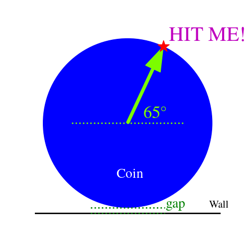

# carrom_punch
Simulation of the punch shot in carrom using scipy's `solve_ivp`

See the jupyter notebook (`carrom_punch.ipynb`) for the code and documentation. The python script (`carrom_punch.py`) can be used for parallelized simulations.

Though this is still not complete, based on the current results, it seems that **for typical gaps and speeds, one should aim for an impact at $65^\circ$ on the coin**

